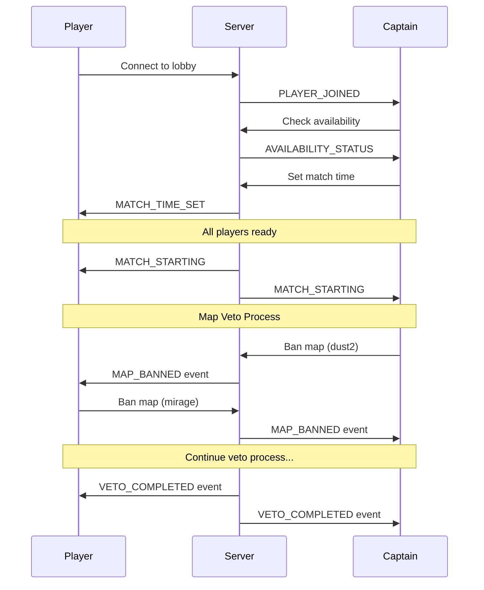

# CS2 10mans Backend API - Complete Implementation Plan with RBAC

## Phase 1: Core Data Models & Tournament Structure (Week 1)
**Priority: Critical** - Foundation for all functionality

### 1.1 Core Tournament & Game Mode Models
- **Database Models**
  ```python
  # Tournament Configuration Models
  class GameMode(StrEnum):
      COMPETITIVE_5V5 = "competitive_5v5"
      WINGMAN_2V2 = "wingman_2v2"
      RETAKE = "retake"
      DEATHMATCH = "deathmatch"
  
  class MapCategory(StrEnum):
      COMPETITIVE = "competitive"
      WINGMAN = "wingman"
      HOSTAGE = "hostage"
      CUSTOM = "custom"
  
  class LeagueFormat(StrEnum):
      HOME_AWAY = "home_away"
      SINGLE_ROUND_ROBIN = "single_round_robin"
      DOUBLE_ROUND_ROBIN = "double_round_robin"
      SWISS = "swiss"
  
  class MapSelectionMethod(StrEnum):
      ADMIN_ASSIGNED = "admin_assigned"
      TEAM_PICK = "team_pick"
      MAP_VETO = "map_veto"
      RANDOM = "random"
  
  # Map Pool Selection Models
  class MapPoolSelectionType(StrEnum):
      ADMIN_DEFINED = "admin_defined"
      TEAM_VOTING = "team_voting"
      PLAYER_VOTING = "player_voting"
  
  class MapPoolStatus(StrEnum):
      VOTING = "voting"
      FINALIZED = "finalized"
      CANCELLED = "cancelled"
  
  # Update Tournament model
  class Tournament(SQLModel):
      # ... existing fields ...
      game_mode: GameMode
      league_format: LeagueFormat
      map_selection_method: MapSelectionMethod
      scheduling_config: Dict[str, Any]  # For scheduling preferences
  
  # Update Map model
  class Map(SQLModel):
      # ... existing fields ...
      category: MapCategory
      supported_modes: List[GameMode]
  
  # Map Pool Models
  class TournamentMapPool(SQLModel):
      id: UUID4
      tournament_id: UUID4
      selection_type: MapPoolSelectionType
      status: MapPoolStatus
      voting_start: Optional[datetime]
      voting_end: Optional[datetime]
      maps_to_select: Optional[int]
      votes_per_team: Optional[int]
      created_at: datetime
      finalized_at: Optional[datetime]
  
  class MapPoolVote(SQLModel):
      id: UUID4
      pool_id: UUID4
      team_id: UUID4
      map_id: UUID4
      voted_at: datetime
  
  # Linked Tournament for progression
  class LinkedTournament(SQLModel):
      id: UUID4
      source_tournament_id: UUID4  # League
      target_tournament_id: UUID4  # Knockout
      qualification_rules: Dict[str, Any]
      created_at: datetime
```

### 1.2 Scheduling & Availability Models
- **Database Models**
  ```python
  # Availability Models
  class AvailabilityType(StrEnum):
      AVAILABLE = "available"
      MAYBE = "maybe"
      UNAVAILABLE = "unavailable"
  
  class AvailabilityStatus(StrEnum):
      ACTIVE = "active"
      CANCELLED = "cancelled"
      EXPIRED = "expired"
  
  class PlayerAvailability(SQLModel):
      id: UUID4
      player_id: UUID4
      tournament_id: Optional[UUID4]  # Null for general availability
      start_time: datetime
      end_time: datetime
      availability_type: AvailabilityType
      status: AvailabilityStatus = AvailabilityStatus.ACTIVE
      is_substitute: bool = False
      notes: Optional[str]
      recurring: bool = False
      recurring_pattern: Optional[Dict]  # For weekly patterns
      created_at: datetime
      updated_at: datetime
  
  class TeamAvailability(SQLModel):
      id: UUID4
      team_id: UUID4
      tournament_id: UUID4
      date: date
      available_players: List[UUID4]
      maybe_players: List[UUID4]
      unavailable_players: List[UUID4]
      available_substitutes: List[UUID4]
      has_minimum_players: bool
      updated_at: datetime
  
  # Scheduling Assistance Models
  class ScheduleSuggestion(SQLModel):
      id: UUID4
      fixture_id: UUID4
      suggested_time: datetime
      confidence_score: float
      available_players_team1: int
      available_players_team2: int
      conflicts: List[Dict]
      created_at: datetime
  
  class ScheduleConflict(SQLModel):
      id: UUID4
      fixture_id: UUID4
      conflict_type: str  # "player_unavailable", "venue_booked", etc.
      description: str
      severity: str  # "low", "medium", "high"
      affected_players: List[UUID4]
      created_at: datetime
```

### 1.3 Match Evidence & Demo Models
- **Database Models**
  ```python
  class EvidenceStatus(StrEnum):
      PENDING = "pending"
      CONFIRMED = "confirmed"
      DISPUTED = "disputed"
      REJECTED = "rejected"
  
  class MatchEvidence(SQLModel):
      id: UUID4
      fixture_id: UUID4
      match_number: int  # For BO3/BO5
      demo_url: str
      stats_url: Optional[str]
      upload_type: str  # "manual", "automatic"
      status: EvidenceStatus = EvidenceStatus.PENDING
      submitted_by: UUID4
      submitted_at: datetime
      
  class EvidenceConfirmation(SQLModel):
      id: UUID4
      evidence_id: UUID4
      confirmed_by: UUID4
      team_id: UUID4
      status: str  # "confirmed", "disputed"
      notes: Optional[str]
      confirmed_at: datetime
```

### 1.4 Lobby & Map Veto Models
- **Database Models**
  ```python
  class LobbyPhase(StrEnum):
      WAITING = "waiting"
      VETO = "veto"
      READY = "ready"
      LIVE = "live"
  
  class VetoActionType(StrEnum):
      BAN = "ban"
      PICK = "pick"
      SIDE = "side"
  
  class LobbyState(SQLModel):
      id: UUID4
      fixture_id: UUID4
      team_1_ready: bool = False
      team_2_ready: bool = False
      connected_players: List[UUID4]
      current_phase: LobbyPhase = LobbyPhase.WAITING
      created_at: datetime
      updated_at: datetime
  
  class MapVetoSession(SQLModel):
      id: UUID4
      fixture_id: UUID4
      format: str  # "bo1", "bo3", "bo5"
      status: str  # "pending", "in_progress", "completed"
      current_team_id: Optional[UUID4]
      current_action: Optional[VetoActionType]
      deadline: Optional[datetime]
      created_at: datetime
      
  class MapVetoAction(SQLModel):
      id: UUID4
      session_id: UUID4
      team_id: UUID4
      action_type: VetoActionType
      map_id: Optional[UUID4]
      side: Optional[str]  # "ct", "t"
      timestamp: datetime
```

### 1.5 Initial API Endpoints with RBAC
- **Tournament Configuration**
  ```
  POST   /tournaments                    # Create with all configurations [manage_tournaments]
  GET    /tournaments/{id}/config        # Get tournament configuration [view_tournament/user]
  PATCH  /tournaments/{id}/config        # Update tournament configuration [manage_tournament]
  POST   /tournaments/{id}/link          # Link league to knockout [manage_tournament]
  GET    /maps/by-mode/{game_mode}       # Get maps for specific mode [user]
  GET    /maps/by-category/{category}    # Get maps by category [user]
  ```

- **Map Pool Management**
  ```
  POST   /tournaments/{id}/map-pool      # Create map pool [manage_tournament]
  GET    /tournaments/{id}/map-pool      # Get map pool [view_tournament/user]
  POST   /tournaments/{id}/map-pool/vote # Vote for maps [team_captain]
  POST   /tournaments/{id}/map-pool/finalize # Finalize map pool [manage_tournament]
  ```

- **Availability Management (Player)**
  ```
  POST   /availability                   # Add availability [user]
  GET    /availability/me                # Get personal availability [user]
  PATCH  /availability/{id}              # Update availability [user:self]
  DELETE /availability/{id}              # Remove availability [user:self]
  GET    /availability/team/{team_id}    # Get team availability [team_captain]
  ```

## Phase 2: Tournament Generation & Core Services (Week 2)
**Priority: Critical** - Required for tournament functionality

### 2.1 Tournament Generation System
- **Services**
  ```python
  class TournamentGenerationService:
      def __init__(self, status_transition_service: StatusTransitionService):
          self.status_transition = status_transition_service
          
      async def generate_tournament_structure(tournament: Tournament)
      async def generate_next_round(tournament: Tournament)
      async def generate_fixtures(round: Round, teams: List[Team])
      async def apply_seeding(teams: List[Team], rules: Dict)
  ```

- **API Endpoints**
  ```
  POST   /tournaments/{id}/generate      # Generate tournament structure [manage_tournament]
  POST   /tournaments/{id}/generate-next-round  # Generate next round [manage_tournament]
  GET    /tournaments/{id}/generation-options   # Get available options [manage_tournament]
  POST   /tournaments/{id}/qualify-teams        # Qualify teams to linked tournament [manage_tournament]
  ```

### 2.2 Status Transition Integration
- **Status Managers**
  ```python
  # Add to existing status managers
  def initialize_availability_status_manager() -> StatusTransitionManager:
      manager = StatusTransitionManager(
          status_enum=AvailabilityStatus,
          entity_type="PlayerAvailability"
      )
      
      # Define transition rules
      manager.add_rule(StatusTransitionRule(
          from_status={AvailabilityStatus.ACTIVE},
          to_status={AvailabilityStatus.CANCELLED},
          validators=[HasRequiredReasonValidator()],
          required_permissions=["user"]  # Users can cancel their own
      ))
      
      return manager
  
  def initialize_evidence_status_manager() -> StatusTransitionManager:
      manager = StatusTransitionManager(
          status_enum=EvidenceStatus,
          entity_type="MatchEvidence"
      )
      
      # Define transition rules
      manager.add_rule(StatusTransitionRule(
          from_status={EvidenceStatus.PENDING},
          to_status={EvidenceStatus.CONFIRMED},
          validators=[TeamCaptainValidator()],
          required_permissions=["confirm_results"]
      ))
      
      return manager
  ```

## Phase 3: Scheduling & Availability System (Week 3)
**Priority: High** - Essential for match coordination

### 3.1 Availability Services
- **Services**
  ```python
  class AvailabilityService:
      def __init__(self, status_transition_service: StatusTransitionService):
          self.status_transition = status_transition_service
      
      async def add_availability(self, player: Player, 
                               availability_data: PlayerAvailabilityCreate) -> PlayerAvailability
      async def update_availability_status(self, availability: PlayerAvailability, 
                                         new_status: AvailabilityStatus)
      async def get_team_availability(self, team_id: UUID4, 
                                    start_date: datetime, end_date: datetime) -> TeamAvailability
      async def find_optimal_times(self, team_1_id: UUID4, team_2_id: UUID4, 
                                 tournament_id: UUID4) -> List[ScheduleSuggestion]
      async def check_conflicts(self, fixture_id: UUID4, 
                              proposed_time: datetime) -> List[ScheduleConflict]
  ```

### 3.2 Team Captain Scheduling Tools
- **API Endpoints**
  ```
  GET    /teams/{id}/availability              # Get team availability overview [team_captain]
  GET    /teams/{id}/availability/aggregate    # Get aggregated availability [team_captain]
  GET    /teams/{id}/availability/optimal      # Get optimal scheduling times [team_captain]
  GET    /teams/{id}/substitutes/available     # Get available substitutes [team_captain]
  POST   /teams/{id}/schedule-match            # Schedule match with availability check [schedule_matches]
  ```

### 3.3 Scheduling Assistant Service
- **Services**
  ```python
  class SchedulingAssistantService:
      def __init__(self, availability_service: AvailabilityService):
          self.availability = availability_service
      
      async def suggest_fixture_times(self, fixture: Fixture) -> List[ScheduleSuggestion]
      async def optimize_round_schedule(self, round_id: UUID4) -> Dict[UUID4, datetime]
      async def get_substitute_recommendations(self, fixture: Fixture, team_id: UUID4)
      async def validate_schedule(self, fixture_id: UUID4, proposed_time: datetime)
  ```

## Phase 4: Match Evidence & Demo Management (Week 4)
**Priority: High** - Required for match integrity

### 4.1 Evidence Management Service
- **Services**
  ```python
  class EvidenceService:
      def __init__(self, status_transition_service: StatusTransitionService):
          self.status_transition = status_transition_service
      
      async def submit_evidence(self, fixture: Fixture, evidence_data: MatchEvidenceCreate)
      async def confirm_evidence(self, evidence: MatchEvidence, captain: Player)
      async def dispute_evidence(self, evidence: MatchEvidence, captain: Player, reason: str)
      async def parse_demo_stats(self, demo_url: str) -> Dict
  ```

### 4.2 Demo Integration Service
- **Configuration**
  ```python
  DEMO_SERVICE_CONFIG = {
      "base_url": "https://demos.cs210mans.uk",
      "processed_path": "/processed/{file_name}.dem.bz2",
      "stats_path": "/stats/{file_name}.stats.json",
      "supported_formats": [".dem", ".dem.bz2"],
      "max_file_size": "500MB"
  }
  ```

### 4.3 Evidence API Endpoints
- **API Endpoints**
  ```
  POST   /fixtures/{id}/evidence              # Submit match evidence [team_captain]
  GET    /fixtures/{id}/evidence              # Get all evidence [view_matches]
  POST   /fixtures/{id}/evidence/{eid}/confirm # Confirm evidence [confirm_results]
  POST   /fixtures/{id}/evidence/{eid}/dispute # Dispute evidence [team_captain]
  GET    /fixtures/{id}/evidence/{eid}/stats   # Get parsed stats [view_matches]
  ```

## Phase 5: Real-time Match Lobby System (Week 5)
**Priority: High** - Enhances user experience

### 5.1 WebSocket Infrastructure
- **WebSocket Handlers**
  ```python
  class LobbyWebSocketHandler:
      async def on_connect(self, websocket: WebSocket, fixture_id: UUID4)
      async def on_player_ready(self, player_id: UUID4, ready: bool)
      async def on_veto_action(self, action: MapVetoAction)
      async def broadcast_lobby_state(self, fixture_id: UUID4)
  ```

### 5.2 Map Veto System
- **Services**
  ```python
  class MapVetoService:
      async def start_veto_session(self, fixture: Fixture) -> MapVetoSession
      async def process_veto_action(self, session: MapVetoSession, action: MapVetoAction)
      async def validate_veto_action(self, session: MapVetoSession, action: MapVetoAction)
      async def complete_veto_session(self, session: MapVetoSession)
  ```

- **API Endpoints**
  ```
  POST   /fixtures/{id}/veto/start       # Start veto session [schedule_matches]
  POST   /fixtures/{id}/veto/action      # Submit veto action [team_captain]
  GET    /fixtures/{id}/veto/state       # Get current state [user]
  POST   /fixtures/{id}/veto/timeout     # Handle timeout [manage_tournament]
  ```

### 5.3 WebSocket Endpoints
- **WebSocket Endpoints**
  ```
  WS    /ws/fixtures/{id}/lobby          # Main lobby connection [user]
  WS    /ws/fixtures/{id}/chat           # Match chat [user]
  WS    /ws/fixtures/{id}/veto           # Map veto specific [team_captain]
  ```

## Phase 6: Admin Tools & Automation (Week 6)
**Priority: High** - Required for tournament administration

### 6.1 Enhanced Admin Routes
- **Tournament Management**
  ```
  POST   /admin/tournaments/{id}/seed                 # Manual seeding [manage_tournament]
  POST   /admin/tournaments/{id}/reschedule-round     # Bulk reschedule [manage_tournament]
  POST   /admin/tournaments/{id}/clone                # Clone tournament [manage_tournaments]
  POST   /admin/tournaments/{id}/cancel-round         # Cancel entire round [manage_tournament]
  GET    /admin/tournaments/{id}/export               # Export data [manage_tournament]
  ```

- **Fixture Management**
  ```
  PATCH  /admin/fixtures/{id}/force-result            # Force match result [manage_tournament]
  POST   /admin/fixtures/{id}/reset                   # Reset to scheduled [manage_tournament]
  POST   /admin/fixtures/bulk-update                  # Bulk operations [manage_fixtures]
  ```

### 6.2 Automation Service
- **Services**
  ```python
  class AutomationService:
      async def check_fixture_deadlines(self)
      async def process_automatic_forfeits(self)
      async def send_match_reminders(self)
      async def update_availability_status(self)  # Mark expired availabilities
      async def generate_schedule_suggestions(self)
  ```

## Phase 7: Statistics & Analytics (Week 7)
**Priority: Medium** - Important for competitive integrity

### 7.1 Statistics Models
- **Database Models**
  ```python
  class PlayerStatistics(SQLModel):
      player_id: UUID4
      season_id: UUID4
      matches_played: int
      matches_won: int
      rounds_played: int
      rounds_won: int
      kills: int
      deaths: int
      assists: int
      rating: float
      
  class TeamStatistics(SQLModel):
      team_id: UUID4
      tournament_id: UUID4
      matches_played: int
      matches_won: int
      rounds_won: int
      rounds_lost: int
      maps_played: Dict[UUID4, int]
  ```

### 7.2 Analytics Service
- **Services**
  ```python
  class AnalyticsService:
      async def calculate_player_stats(self, player_id: UUID4, season_id: UUID4)
      async def calculate_team_stats(self, team_id: UUID4, tournament_id: UUID4)
      async def generate_leaderboards(self, season_id: UUID4)
      async def analyze_map_performance(self, team_id: UUID4)
  ```

### 7.3 Statistics API Endpoints
- **API Endpoints**
  ```
  GET    /players/{id}/stats             # Player statistics [user]
  GET    /teams/{id}/stats               # Team statistics [user]
  GET    /tournaments/{id}/stats         # Tournament statistics [user]
  GET    /seasons/{id}/stats             # Season statistics [user]
  GET    /stats/leaderboard              # Global leaderboards [user]
  GET    /reports/tournament/{id}        # Tournament report [manage_tournament]
  GET    /reports/season/{id}            # Season report [admin]
  GET    /reports/player/{id}/performance # Player performance [user]
  GET    /reports/team/{id}/analysis     # Team analysis [team_captain]
  ```

## Phase 8: Enhanced Notification System (Week 8)
**Priority: Medium** - Improves user experience

### 8.1 Notification Types
- **Extended Notification Types**
  ```python
  class NotificationType(StrEnum):
      # Match notifications
      MATCH_SCHEDULED = "match_scheduled"
      MATCH_STARTING = "match_starting"
      RESULT_SUBMITTED = "result_submitted"
      
      # Availability notifications
      AVAILABILITY_REQUEST = "availability_request"
      SCHEDULE_SUGGESTION = "schedule_suggestion"
      SCHEDULE_CONFLICT = "schedule_conflict"
      SUBSTITUTE_NEEDED = "substitute_needed"
      OPTIMAL_TIME_FOUND = "optimal_time_found"
      
      # Tournament notifications
      TOURNAMENT_UPDATE = "tournament_update"
      ROSTER_CHANGE = "roster_change"
  ```

### 8.2 Notification Service
- **Services**
  ```python
  class NotificationService:
      async def send_notification(self, user_id: UUID4, notification: Notification)
      async def send_email_notification(self, user_id: UUID4, template: str, data: Dict)
      async def send_discord_notification(self, webhook_url: str, message: Dict)
      async def send_availability_reminder(self, team_id: UUID4, tournament_id: UUID4)
  ```

### 8.3 Notification API Endpoints
- **API Endpoints**
  ```
  GET    /notifications                  # Get user notifications [user]
  POST   /notifications/{id}/read        # Mark notification as read [user]
  POST   /notifications/subscribe        # Subscribe to notification types [user]
  POST   /notifications/unsubscribe      # Unsubscribe from notification types [user]
  ```

## Phase 9: Enhanced Substitute System (Week 8)
**Priority: Medium** - Quality of life improvements

### 9.1 Substitute API Endpoints
- **API Endpoints**
  ```
  POST   /fixtures/{id}/request-substitute    # Request substitute [team_captain]
  POST   /fixtures/{id}/substitute/approve    # Approve substitute [team_captain]
  GET    /substitutes/available              # Get available substitutes [team_captain]
  POST   /substitutes/register               # Register as substitute [user]
  PATCH  /substitutes/availability           # Update substitute availability [user]
  ```

### 9.2 Substitute Service
- **Services**
  ```python
  class SubstituteService:
      async def register_substitute(self, player: Player, tournament_id: UUID4)
      async def request_substitute(self, fixture: Fixture, team_id: UUID4)
      async def approve_substitute(self, fixture: Fixture, substitute_id: UUID4)
      async def get_available_substitutes(self, tournament_id: UUID4, date: datetime)
  ```

## Phase 10: Testing & Documentation (Weeks 9-10)
**Priority: Critical** - Ensures reliability

### 10.1 Test Suites
- **Test Coverage**
  - Unit tests for all services
  - Integration tests for API endpoints
  - WebSocket connection tests
  - Availability calculation tests
  - Tournament generation tests
  - Status transition tests
  - Load testing for concurrent matches
  - RBAC permission tests

### 10.2 Documentation
- **API Documentation**
  - OpenAPI/Swagger specifications
  - WebSocket protocol documentation
  - Integration guides
  - Admin user manual
  - Developer setup guide
  - Status transition diagram
  - RBAC permission matrix

## RBAC Permission Matrix

### Core Permissions
| Permission | Description | Scope |
|------------|-------------|-------|
| user | Basic authenticated user | Global |
| admin | System administrator | Global |
| moderator | Community moderator | Global |
| manage_tournaments | Create/manage tournaments | Global |
| manage_tournament | Manage specific tournament | Tournament |
| view_tournament | View tournament details | Tournament |
| manage_teams | Create/manage teams | Global |
| manage_team | Manage specific team | Team |
| team_captain | Team captain permissions | Team |
| schedule_matches | Schedule match times | Tournament |
| confirm_results | Confirm match results | Tournament |
| view_matches | View match details | Tournament |
| manage_fixtures | Manage fixtures | Global |
| manage_bans | Manage player bans | Global |
| verify_users | Verify new users | Global |
| manage_users | User management | Global |
| manage_roles | Role management | Global |
| manage_maps | Map management | Global |

### Permission Inheritance
1. `admin` has all permissions
2. `manage_tournament` includes `view_tournament`, `schedule_matches`, `view_matches`
3. `team_captain` includes `manage_team`, `schedule_matches` (for own team), `confirm_results` (for own team)
4. `moderator` includes `view_tournament`, `view_matches`, `manage_bans`

## Map Veto Format Examples

### BO1 Veto Format
```
1ban_1ban_1ban_1ban_1ban_1ban_1pick
```

### BO3 Veto Format  
```
1ban_1ban_1pick_1pick_1ban_1ban_1pick
```

### BO5 Veto Format
```
1ban_1ban_1pick_1pick_1pick_1pick_1pick
```

## Implementation Timeline

| Week | Primary Focus | Secondary Focus |
|------|--------------|----------------|
| 1 | All Data Models & Infrastructure | Database Migrations |
| 2 | Tournament Generation System | Status Transition Setup |
| 3 | Scheduling & Availability System | API Development |
| 4 | Match Evidence & Demo System | Demo Integration |
| 5 | Real-time Lobby System | WebSocket Infrastructure |
| 6 | Admin Tools & Automation | Background Tasks |
| 7 | Statistics & Analytics | Performance Optimization |
| 8 | Notification & Substitute Systems | External Integrations |
| 9 | Testing Infrastructure | Bug Fixes |
| 10 | Documentation | Final Testing |

## Configuration Examples

### Tournament with Full Configuration
```json
{
  "name": "CS2 Winter League 2024",
  "type": "regular",
  "game_mode": "competitive_5v5",
  "league_format": "double_round_robin",
  "map_selection_method": "team_pick",
  "scheduling_config": {
    "minimum_players_required": 5,
    "substitute_threshold": 3,
    "advance_notice_hours": 48,
    "preferred_time_slots": [
      {"day": "friday", "start": "19:00", "end": "23:00"},
      {"day": "saturday", "start": "14:00", "end": "23:00"},
      {"day": "sunday", "start": "14:00", "end": "22:00"}
    ],
    "blackout_periods": [
      {"start": "2024-12-24", "end": "2024-12-26", "reason": "Christmas"},
      {"start": "2024-12-31", "end": "2025-01-02", "reason": "New Year"}
    ],
    "auto_suggest_enabled": true,
    "conflict_resolution": "captain_override"
  },
  "format_config": {
    "group_size": 8,
    "teams_per_group": 4,
    "match_format": "bo3",
    "map_veto": {
      "bo1": "1ban_1ban_1ban_1ban_1ban_1ban_1pick",
      "bo3": "1ban_1ban_1pick_1pick_1ban_1ban_1pick",
      "bo5": "1ban_1ban_1pick_1pick_1pick_1pick_1pick"
    }
  }
}
```

### Major-Style Tournament
```json
{
  "type": "knockout",
  "game_mode": "competitive_5v5",
  "map_selection_method": "map_veto",
  "format_config": {
    "group_stage": {
      "enabled": true,
      "format": "swiss",
      "rounds": 5,
      "advance_teams": 8
    },
    "knockout_stage": {
      "format": "single_elimination",
      "match_formats": {
        "quarterfinals": "bo3",
        "semifinals": "bo3",
        "finals": "bo5"
      }
    },
    "map_veto": {
      "bo1": "1ban_1ban_1ban_1ban_1ban_1ban_1pick",
      "bo3": "1ban_1ban_1pick_1pick_1ban_1ban_1pick",
      "bo5": "1ban_1ban_1pick_1pick_1pick_1pick_1pick"
    }
  }
}
```

## WebSocket Event Flow

### Lobby Events Flow


## Security Considerations

1. **Availability Permissions** - Players can only modify their own availability
2. **Scheduling Permissions** - Only team captains can schedule matches
3. **Evidence Validation** - File upload validation and virus scanning
4. **WebSocket Authentication** - JWT validation for WebSocket connections
5. **Rate Limiting** - Prevent availability spam and DOS attacks
6. **RBAC Enforcement** - Strict role-based access control on all endpoints

## Performance Optimizations

1. **Availability Caching** - Cache team availability aggregates
2. **Schedule Generation** - Background job for schedule optimization
3. **Demo Processing** - Async processing for demo file analysis
4. **WebSocket Scaling** - Redis PubSub for multi-instance deployments
5. **Database Indexes** - Optimize queries for availability lookups
6. **Statistics Caching** - Cache frequently accessed statistics

## Post-Launch Roadmap

1. **Mobile App Integration** - API endpoints for mobile clients
2. **Advanced Analytics** - Machine learning for match predictions
3. **Streaming Integration** - Twitch/YouTube API integration
4. **Automated Casting** - AI-powered match commentary
5. **Community Features** - Forums, user profiles, achievements

## Critical Success Factors

1. **Database Design** - Proper modeling of game modes and tournament formats
2. **Real-time Features** - Stable WebSocket implementation for match lobbies
3. **Admin Tools** - Comprehensive tournament management capabilities
4. **Evidence System** - Reliable demo storage and validation
5. **Testing** - Thorough testing of all tournament scenarios
6. **RBAC System** - Proper implementation of role-based access control

## Risk Mitigation

1. **Performance** - Implement caching for statistics and leaderboards
2. **Scalability** - Design WebSocket system to handle multiple concurrent lobbies
3. **Data Integrity** - Implement transaction management for critical operations
4. **Security** - Add rate limiting and proper authorization checks
5. **Reliability** - Implement circuit breakers for external services (S3, Discord)

## Database Schema Updates

### New Tables
- `game_modes` - Defines available game modes
- `map_categories` - Categorizes maps
- `linked_tournaments` - Links leagues to knockouts
- `match_evidence` - Stores demo files and stats
- `evidence_confirmations` - Tracks evidence verification
- `map_veto_sessions` - Manages map selection process
- `map_veto_actions` - Records veto decisions
- `player_statistics` - Tracks player performance
- `team_statistics` - Tracks team performance
- `notifications` - Manages user notifications
- `tournament_map_pools` - Manages map pools for tournaments
- `map_pool_votes` - Tracks map pool voting

### Updated Tables
- `tournaments` - Add game_mode, league_format, map_selection_method, scheduling_config
- `maps` - Add category, supported_modes
- `fixtures` - Add veto_session_id

## Development Guidelines

1. **API Versioning** - Maintain backward compatibility
2. **Error Handling** - Consistent error response format
3. **Logging** - Structured logging for debugging
4. **Security** - JWT authentication, role-based access
5. **Performance** - Index optimization, query caching
6. **Documentation** - OpenAPI specs, code comments
7. **RBAC** - Consistent permission checking across all endpoints

## Deployment Strategy

1. **Staging Environment** - Test all features
2. **Database Migrations** - Automated, reversible
3. **Feature Flags** - Gradual feature rollout
4. **Monitoring** - APM, error tracking
5. **Backup Strategy** - Regular database backups
6. **Security Audits** - Regular security reviews